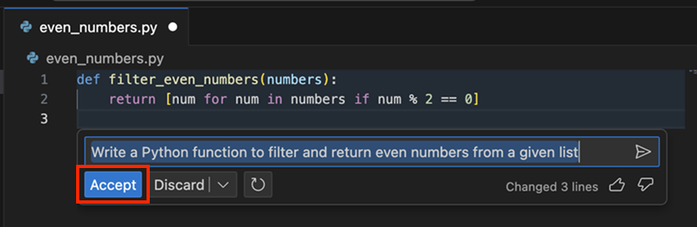
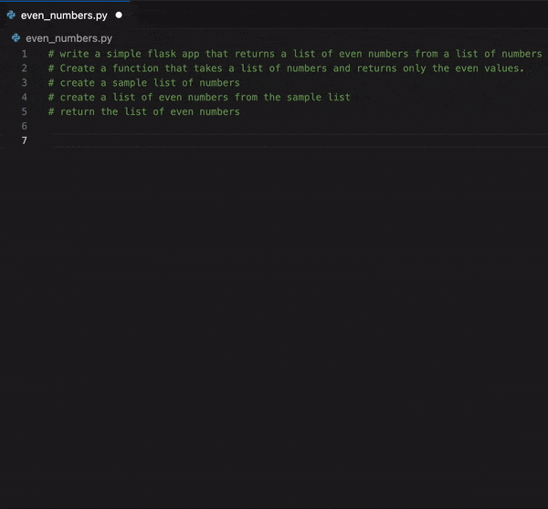
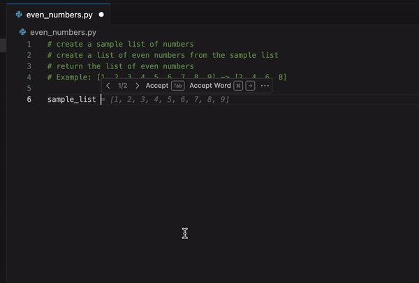
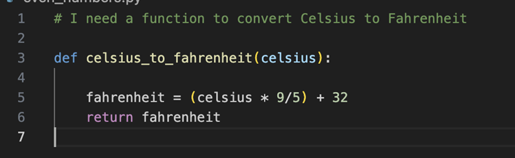
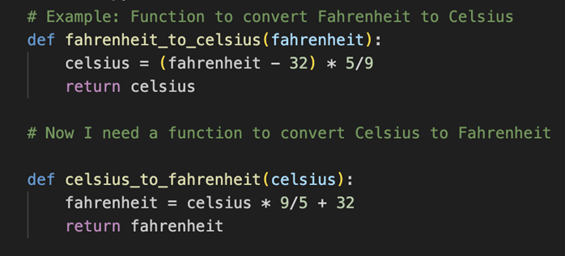
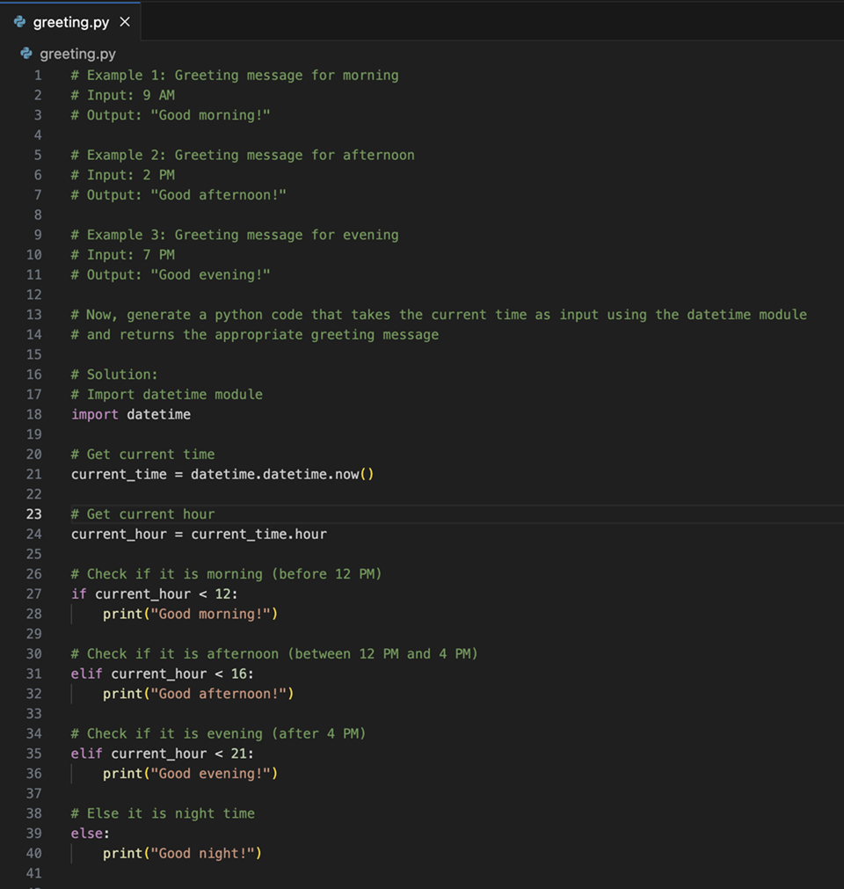
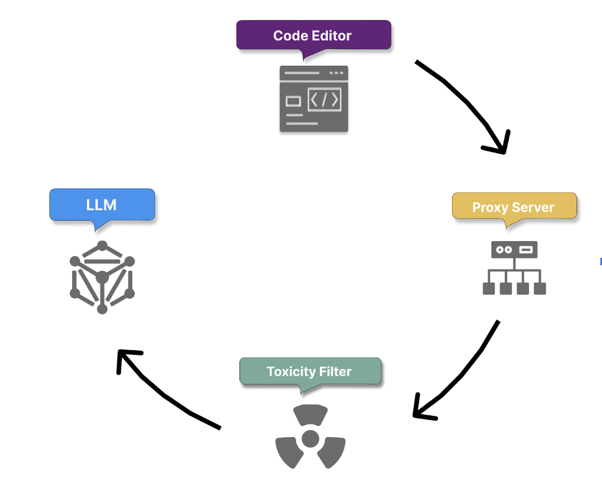
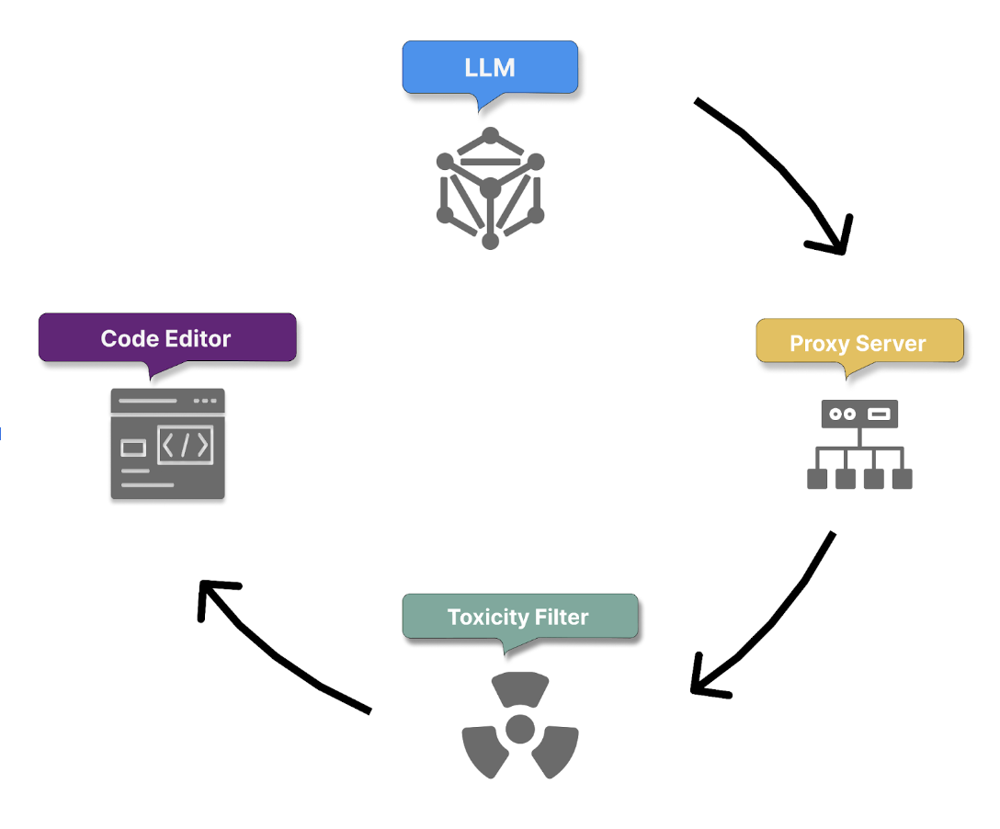

# Module 1: Responsible AI with GitHub Copilot

## Introduction

## Mitigate AI risks

AI offers significant benefits but also introduces risks such as:

- Lack of transparency in decision-making
- Biased or unfair outcomes
- Privacy and security concerns

To reduce these risks, organizations should:

- Establish strong AI governance frameworks
- Ensure transparency in AI processes
- Maintain human oversight and accountability

These measures help maximize AI's benefits while minimizing potential harm.

### Responsible AI

Responsible AI is the practice of developing, evaluating, and deploying AI systems in a safe, ethical, and trustworthy manner. Since AI systems reflect the decisions of their creators and users, Responsible AI promotes outcomes that are fair, reliable, transparent, and human-centered, ensuring technology aligns with people's needs and values.

## Microsoft and GitHub's six principles of Responsible AI


Microsoft is a global leader in Responsible AI, identifying six key principles that should guide AI development and usage. These principles are:

- **Fairness**: AI systems should treat all people fairly.
- **Reliability and safety**: AI systems should perform reliably and safely.
- **Privacy and security**: AI systems should be secure and respect privacy.
- **Inclusiveness**: AI systems should empower everyone and engage people.
- **Transparency**: AI systems should be understandable.
- **Accountability**: People should be accountable for AI systems.

## Module assessment

Choose the best response for each question.

**Check your knowledge**

1. What is the primary goal of Responsible AI?
   - To maximize profits from AI systems.
   - To develop AI systems as quickly as possible.
   - **To ensure AI systems are safe, trustworthy, and ethical.**
   - To replace human decision-making with AI.

2. Which principle is NOT one of the six identified by Microsoft for Responsible AI?
   - Fairness.
   - **Innovation.**
   - Inclusiveness.
   - Accountability.

3. What does the principle of Fairness in Responsible AI emphasize?
   - Maximizing AI performance at all costs.
   - **Ensuring AI systems perform equally well across all demographic groups.**
   - Prioritizing profitability over ethical concerns.
   - Creating AI systems that are easy to understand.

4. How does Microsoft address potential biases in AI systems?
   - By ignoring the issue and focusing on other areas.
   - By providing AI systems with more data.
   - **By reviewing training data, testing with balanced samples, and using adversarial debiasing.**
   - By allowing users to modify AI system outputs directly.

5. What is the role of transparency in Microsoft's Responsible AI principles?
   - To keep AI operations secret from the public.
   - **To make AI systems' operations and decisions understandable and clear.**
   - To hide the limitations of AI systems.
   - To prioritize efficiency over ethical considerations.

6. Why is it important for developers to closely scrutinize AI-generated code?
   - To reduce development time.
   - **To ensure that the code aligns with project-specific conventions and requirements.**
   - To enhance the creative aspect of coding.
   - To automatically improve system performance.

---

# Module 2: Introduction to GitHub Copilot

## GitHub Copilot, your AI pair programmer

AI is transforming software development by helping teams build, test, and deliver applications more efficiently. GitHub Copilot acts as an AI pair programmer, supporting developers across popular programming languages.

Key reported benefits include:

- 46% of new code generated by AI
- 55% faster developer productivity
- 74% of developers feeling more focused on meaningful work

GitHub Copilot was developed by GitHub and Microsoft in collaboration with OpenAI. It is powered by OpenAI Codex, a model specialized in code generation and trained on large amounts of public source code, enabling it to understand and generate code more effectively than earlier general-purpose models like GPT-3.

### GitHub Copilot features

#### Copilot Chat
GitHub Copilot includes an interactive chat experience directly inside supported editors (like Visual Studio Code, Visual Studio, and others). With chat, you can:

- Ask questions about your code
- Get explanations of logic or errors
- Generate tests or documentation
- Explore how to implement new features

The chat understands your code context and relates responses back to your project.

#### Copilot pull request summaries
*(3 sentences)*

#### Copilot code review assistance
*(3 sentences)*

#### Copilot for the CLI
*(3 sentences)*

#### Copilot Spaces
*(3 sentences)*

#### Copilot Cloud Agent
*(3 sentences)*

## Interact with Copilot

### Inline suggestions
Inline suggestions are the most immediate form of assistance in Copilot. As you type, Copilot analyzes your code and context to offer real-time code completions. This feature predicts what you might want to write next and displays suggestions in a subtle, unobtrusive way.

### Command palette
The command palette provides quick access to the various functions in Copilot, so you can perform complex tasks with only a few keystrokes.

### Copilot Chat
Copilot Chat is an interactive feature that enables you to communicate with Copilot using natural language. You can ask questions or request code snippets, and Copilot provides responses based on your input.

1. Open the Copilot Chat panel in your IDE.
2. Enter questions or requests in natural language, and then evaluate the Copilot response.

#### Inline chat
Inline chat enables context-specific conversations with Copilot directly within your code editor. You can use this feature to request code modifications or explanations without switching contexts.

1. Place your cursor where you want assistance.
2. Use the keyboard shortcut Ctrl+I (Windows or Linux) or Cmd+I (Mac) to open inline chat.
3. Ask questions or request changes specific to that code location.

Here are some common slash commands and their usage:

- `/explain` - Provides an explanation of the selected code.
- `/suggest` - Offers code suggestions based on the current context.
- `/tests` - Generates unit tests for the selected function or class.
- `/comment` - Converts comments into code snippets.

### Comments to code
Copilot uses natural language processing to convert comments into code. You can describe the functionality that you want in a comment. When you press Enter, Copilot generates code based on your description.

Example (Python):
```python
# Function to reverse a string
def reverse_string(s):
    # Copilot suggests the function body here
```

### Automated test generation
Unit tests are essential for ensuring code quality and reliability. Copilot can save you time and effort by generating unit tests for your functions or classes.

1. Select a function or class.
2. Use the command palette to select **Copilot: Generate Unit Tests**.
3. Review the test cases that Copilot suggests for your code.

## Set up, configure, and troubleshoot GitHub Copilot
Install it in VS Code, install the CLI.

## Exercise - Develop with AI-powered code suggestions by using GitHub Copilot and VS Code
Link: https://github.com/skills/getting-started-with-github-copilot

## Module assessment

Check your knowledge — 200 XP, 5 minutes

1. What is GitHub Copilot?
   - **GitHub Copilot is an AI pair programmer that you can use to get code suggestions.**
   - GitHub Copilot is OpenAI Codex, a new AI system that OpenAI created.
   - GitHub Copilot is a JavaScript public repository and is one of the best-supported languages.
   - GitHub Copilot can write a comment that describes logic, and you can add your suggested code to implement the solution.

2. What are the supported IDE extensions for GitHub Copilot?
   - VS Code and Visual Studio
   - **GitHub.com, VS Code, Visual Studio, Neovim, and JetBrains**
   - VS Code, Visual Studio, Neovim, and JetBrains

3. What is the difference between GitHub Copilot Business and GitHub Copilot Enterprise?
   - GitHub Copilot Enterprise has code completions, whereas GitHub Copilot Business doesn't.
   - GitHub Copilot Enterprise has chat in IDE and mobile, whereas GitHub Copilot Business doesn't.
   - GitHub Copilot Enterprise has an extra layer of personalization. Organizations use their own codebase to train GitHub Copilot.
   - **GitHub Copilot Enterprise has an extra layer of security, with IP indemnity and enterprise-grade security, safety, and privacy.**

4. Which plan includes all Pro features plus additional premium usage and priority infrastructure access?
   - GitHub Copilot Free
   - GitHub Copilot Pro
   - **GitHub Copilot Pro+**
   - GitHub Copilot Enterprise

---

# Module 3: Introduction to prompt engineering with GitHub Copilot

## Prompt engineering foundations and best practices

### What is prompt engineering?
Prompt engineering is the process of crafting clear instructions to guide AI systems, like GitHub Copilot, to generate context-appropriate code tailored to your project's specific needs. This ensures the code is syntactically, functionally, and contextually correct.

### Principles of prompt engineering
Before exploring specific strategies, let's first understand the basic principles of prompt engineering, summed up in the 4 Ss below. These core rules are the basis for creating effective prompts.

- **Single**: Always focus your prompt on a single, well-defined task or question. This clarity is crucial for eliciting accurate and useful responses from Copilot.
- **Specific**: Ensure that your instructions are explicit and detailed. Specificity leads to more applicable and precise code suggestions.
- **Short**: While being specific, keep prompts concise and to the point. This balance ensures clarity without overloading Copilot or complicating the interaction.
- **Surround**: Utilize descriptive filenames and keep related files open. This provides Copilot with rich context, leading to more tailored code suggestions.

### Best practices in prompt engineering

#### Provide enough clarity
Building on the "Single" and "Specific" principles, always aim for explicitness in your prompts. For instance, a prompt like "Write a Python function to filter and return even numbers from a given list" is both single-focused and specific.



#### Provide enough context with details
Enrich Copilot's understanding with context, following the "Surround" principle. The more contextual information provided, the more fitting the generated code suggestions are. For example, by adding comments at the top of your code to give more details about what you want, you give Copilot more context to understand your prompt and provide better code suggestions.



#### Provide examples for learning
Using examples can clarify your requirements and expectations, illustrating abstract concepts and making prompts more tangible for Copilot. Well-crafted examples help Copilot understand patterns quickly, leading to more accurate initial suggestions that require fewer revision cycles.



#### Assert and iterate
One of the keys to unlocking GitHub Copilot's full potential and accelerating your development workflow is the practice of strategic iteration. Your first prompt might not always yield production-ready code, and that's perfectly fine. Rather than spending time manually refining the output, treat it as the beginning of an efficient dialogue with Copilot.

If the first output isn't quite what you're looking for, don't start from scratch. Instead, erase the suggested code, enrich your initial comment with added details and examples, and prompt Copilot again. This iterative approach often gets you to high-quality, deployment-ready code faster than traditional development methods, as each iteration builds on Copilot's understanding of your specific requirements.

### Examples

#### Zero-shot learning
Here, GitHub Copilot generates code without any specific examples, relying solely on its foundational training. This approach is ideal for rapidly implementing common patterns and standard functionality.

Example: "Create a function to convert temperatures between Celsius and Fahrenheit."



#### One-shot learning
With this approach, a single example is given, aiding the model in generating more context-aware responses that follow your specific patterns and conventions.



#### Few-shot learning
In this method, Copilot is presented with several examples, which strike a balance between zero-shot unpredictability and the precision of fine-tuning.



#### Chain prompting and managing chat history
When working on complex features that require multiple steps, you might engage in extended conversations with GitHub Copilot Chat. While detailed context helps Copilot understand your requirements, maintaining long conversation histories can become inefficient and costly in terms of processing.

For example, you might start with a basic implementation, then iteratively add error handling, tests, documentation, and optimizations. Each turn builds on the previous context, but the full history grows longer:

- Turn 1: "Create a user authentication function"
- Turn 2: "Add error handling for invalid credentials"
- Turn 3: "Add unit tests for the authentication function"
- Turn 4: "Add JSDoc comments to document the function"
- Turn 5: "Optimize the function for better performance"

To manage this efficiently:

- Summarize context when conversations become lengthy: "Based on our previous discussion about user authentication, now add rate limiting to prevent brute-force attacks."
- Reset and provide focused context for new features: start fresh with essential details rather than carrying forward the entire conversation.
- Use concise references to previous work instead of repeating full implementations.

#### Role prompting for specialized tasks
Role prompting involves instructing GitHub Copilot to act as a specific type of expert, which can significantly improve the quality and relevance of generated code for specialized domains. This approach helps accelerate development by getting more targeted solutions on the first try.

##### Examples

**Security expert role**
"Act as a cybersecurity expert. Create a password validation function that checks for common vulnerabilities and follows OWASP guidelines."

**Performance optimization role**
"Act as a performance optimization expert. Refactor this sorting algorithm to handle large datasets efficiently."

**Testing specialist role**
"Act as a testing specialist. Create comprehensive unit tests for this payment processing module, including edge cases and error scenarios."

## GitHub Copilot user prompt process flow
In this unit, we break down how GitHub Copilot turns your prompts into smart, usable code. Generally, GitHub Copilot receives prompts and returns code suggestions or responses in its data flow. This process involves an inbound and an outbound flow.

### Inbound flow

**GitHub Copilot Prompt Processing**

1. **Secure prompt transmission & context gathering**
   The user prompt is securely sent via HTTPS to GitHub Copilot. Copilot then gathers relevant context, including:
   - Code before and after the cursor
   - File name and type
   - Adjacent open tabs
   - Project structure and file paths
   - Programming languages and frameworks

   It also uses the **Fill-in-the-Middle (FIM)** technique to analyze both preceding and following code, improving context awareness and suggestion accuracy.

2. **Proxy filtering**
   The prompt is routed through a GitHub-managed proxy in Microsoft Azure, which filters malicious requests and blocks attempts to manipulate the system or expose model internals.

3. **Content & safety filtering**
   Before code generation, Copilot filters:
   - Hate speech, offensive, or inappropriate content
   - Personal or sensitive data (e.g., names, addresses, IDs)

4. **Code generation with LLMs**
   The filtered prompt and collected context are sent to large language models (LLMs), which generate relevant, functional, and project-aware code suggestions.



### Outbound flow

5. **Post-processing & response validation**
   After code generation, Copilot applies additional safety and quality checks:
   - Removes harmful or offensive content
   - Validates code quality and security (e.g., XSS, SQL injection)
   - Optionally blocks suggestions longer than ~150 characters that closely match public GitHub code

   Responses that fail these checks are truncated or discarded.

6. **Suggestion delivery & feedback loop**
   Only validated suggestions are shown to the user. Copilot then uses user interactions to improve future performance by learning from:
   - Accepted suggestions
   - Modified suggestions
   - Rejected suggestions

7. **Continuous improvement**
   The process repeats for every new prompt. By leveraging accumulated context, interactions, and feedback, Copilot continuously refines its understanding of user intent and enhances the relevance and quality of its code suggestions.



## Data handling in GitHub Copilot

### Code suggestions
Prompts, code, and context used to generate suggestions are not retained for training foundational models and are discarded after a suggestion is returned. Individual subscribers can opt out of sharing prompts that may otherwise be used to fine-tune GitHub models.

### Copilot Chat
Copilot Chat provides conversational coding assistance and includes:

- **Response formatting**: Highlights code snippets and presents responses clearly within the chat interface.
- **Interactive conversations**: Supports follow-up questions, clarifications, and maintains chat history for context.
- **Data retention**: Prompts, responses, and supporting context are generally retained for 28 days outside the code editor. Retention policies may vary within IDE integrations.

Similar behavior applies to CLI, mobile, and GitHub.com Chat experiences.

### Supported prompt types
Copilot Chat can handle:

- **Direct questions**: coding concepts, troubleshooting, libraries, etc.
- **Code requests**: generate, modify, fix, or explain code.
- **Open-ended queries**: best practices, optimization, architecture guidance.
- **Contextual prompts**: code snippets or project-specific scenarios requiring tailored assistance.

### Context window limitations
Copilot can only process a limited amount of code and text at once:

- Standard Copilot: roughly 200–500 lines of code or a few thousand tokens.
- Copilot Chat: approximately 4,000 tokens (4K context window).

To improve results:

- Break complex tasks into smaller prompts.
- Provide only the most relevant code snippets and context.
- Ask focused questions to help Copilot generate more accurate responses.

## Module assessment

Check your knowledge

1. What is GitHub Copilot?
   - A platform for code repositories.
   - A model powered by machine learning.
   - **An assistant for coding, powered by OpenAI.**
   - A service for web hosting.

2. What role does prompting play in utilizing GitHub Copilot effectively?
   - It generates instant bug fixes.
   - **It enhances the quality of code suggestions.**
   - It automates the coding process entirely.
   - It implements real-time collaboration.

3. Which of the following rules is a principle of the 4S method of prompt engineering?
   - Summarize code objectives concisely.
   - **Specify instructions explicitly and in detail.**
   - Streamline processes for efficient code suggestions.
   - Simplify coding languages for universal understanding.

4. How does GitHub Copilot handle personal data?
   - It saves all personal data for future references.
   - It shares personal data with other users for collaborative projects.
   - It encrypts personal data.
   - **It actively filters out personal data to protect user privacy.**

5. What is LoRA in the context of fine-tuning Large Language Models (LLMs)?
   - **A method that adds trainable elements to each layer of the pretrained model without a complete overhaul.**
   - A technology optimizing communication between different coding languages.
   - A specialized software library enhancing Copilot's performance.
   - A new programming paradigm supported exclusively by Copilot.

6. How does Copilot use context to provide code suggestions?
   - It considers only the prompt text you provide.
   - It considers the file type but not the content of the file.
   - **It considers the surrounding code, file type, and content of parallel open tabs in the code editor.**
   - It randomly selects context from the internet.

7. Which of these strategies helps improve prompt effectiveness in GitHub Copilot?
   - **Providing detailed contextual information with clarity.**
   - Making the prompt as general as possible.
   - Keeping the prompt lengthy and detailed.
   - Avoiding examples in the prompt to not restrict Copilot's creativity.

---

# Module 4: Introduction to Copilot Spaces

## Introduction
What is a GitHub Copilot Space? It's a dedicated Copilot chat grounded in a curated set of context you choose. A Space is itself like an LLM, and you can feed it GitHub files, issues, pull requests, and your own free-text instructions to provide context for your specific topic.

**Setting context for Copilot Spaces**
- Attaching files (uploads)
- Adding instructions

**When to use and create a GitHub Copilot Space**
Use a Space when you want consistent, reproducible answers on a tightly scoped topic, like a particular service, a runbook or playbook, or a known dataset. Compared to general or repo-wide chat, Spaces trade breadth for depth: by narrowing the context to what matters most, they tend to produce more predictable, grounded responses, while broad chat can surface wider discovery but may be less precise.

## Creating your first Space
*(steps...)*

## Exercise - Democratize tribal knowledge using Copilot Spaces
Start the exercise on GitHub: https://github.com/skills/scale-institutional-knowledge-using-copilot-spaces

## Module assessment

1. When is a GitHub Copilot Space the better choice than general or repo-wide chat?
   - When you need broad discovery across many repositories
   - **When you want consistent, reproducible answers on a tightly scoped topic**
   - When you want Copilot to automatically discover any relevant content in your org
   - When you have no specific task or domain in mind

2. Which statement about Space ownership and description is true?
   - A Space must be organization-owned; personal Spaces aren't supported
   - The description changes Copilot's answers in the Space
   - **You can choose personal or organization ownership (where available), and the description is for human readers**
   - Ownership can't be changed once set, and descriptions affect answer quality

3. Which action does NOT add usable context for Copilot in a Space?
   - Attaching files or folders from a GitHub repository
   - Pasting URLs of GitHub issues and pull requests
   - Uploading a local file (for example, a text document or spreadsheet)
   - **@-mentioning a Copilot extension so it can run in Space chat**

4. How do Spaces handle security and access to linked items?
   - A Space grants temporary read access to all linked private repositories
   - **A Space mirrors GitHub permissions and surfaces only what a viewer can already see**
   - A Space creates a copy of private content that anyone with the link can access
   - A Space requires repo admins to approve each viewer manually

5. You need branch-specific guidance or a historical snapshot in a Space. What should you do?
   - Change the repository's default branch to lock Space answers to that branch
   - Rely on general chat to retrieve older versions automatically
   - **Narrow references to relevant files and add a brief example, or attach a text file with the exact content**
   - Paste the sensitive historical content into free-text notes for convenience

6. Which prompting pattern best supports runnable, verifiable outputs in a Space?
   - Ask for a summary without constraints to keep the model creative
   - **Confirm intent, add concrete constraints (formats, ranges, file paths), and request executable outputs with references**
   - Use many broad instructions to widen the context as much as possible
   - Avoid referencing attached sources to prevent overfitting

7. You notice size warnings and increasingly vague answers from your Space. What's the best next step?
   - Add more examples to increase context so the model has more to learn from
   - **Reduce sources or split the Space into smaller, single-job Spaces**
   - Start @-mentioning people to pull in their expertise
   - Turn off repository linking so the Space doesn't change

---

# Module 5: Using advanced GitHub Copilot features

## Introduction
First, launch the Codespaces environment, which comes preconfigured with the GitHub Copilot extension.

1. Open the Codespace with the preconfigured environment in your browser.
2. On the Create codespace page, review the Codespace configuration settings, and then select **Create new codespace**.
3. Wait for the Codespace to start. This startup process can take a few minutes.

The remaining exercises in this project take place in the context of this development container.

## Exercise - Set up GitHub Copilot to work with Visual Studio Code
https://legendary-train-v6qgx6w7x4v5h6wx6.github.dev/

### Step 1: Add a new route
Open the `main.py` file, and use inline chat with the command Ctrl+I (Windows) or Cmd+I (Mac). This asks GitHub Copilot to help you create a new API that shows the cities of a country/region. Use the following prompt:

> Create a new route that exposes the cities of a country/region.

### Step 2: Create a test
Now that you've created a new route, create a test with Copilot Chat for this route that uses Spain as the country/region. Remember to select your code, and ask Copilot Chat to help you with this specific API you just created. You can use inline chat or the dedicated chat pane with the following prompt:

> /tests help me create a new test for this route that uses Spain as the country/region.

### Step 3: Use an agent to write the documentation
Finally, use GitHub Copilot Chat agent mode to write project documentation and details on how to run the project itself. Open the README.md file and use the following prompt in GitHub Copilot Chat:

> I want to document how to run this project so other developers can get started quickly by reading the README.md file.

## Module assessment

5 minutes

1. What is ghost text in GitHub Copilot?
   - **Ghost text in GitHub Copilot refers to suggestions that appear in your text editor as you type.**
   - Ghost text in GitHub Copilot are options used when typing to provide suggestions.
   - Ghost text in GitHub Copilot involves using prompts and natural language questions within your code or documentation.

2. How do you access GitHub Copilot's inline chat?
   - Access the inline chat by clicking on the chat icon in the left sidebar of Visual Studio Code.
   - **Use Ctrl+I on Windows or Cmd+I on Mac to open inline chat.**
   - Access the inline chat by using Alt+I on Windows or Option+I on Mac.

3. What are slash commands used for in GitHub Copilot?
   - Slash commands are used to format your codebase according to best practices.
   - Slash commands are used to debug code and detect security vulnerabilities within your projects.
   - **Slash commands are shortcuts to quickly perform common development tasks within the chat or inline pane.**

4. What are the benefits of using agents like `@terminal` when interacting with GitHub Copilot?
   - **Agents in Visual Studio Code help you ask questions within a specific context, allowing for more precise and relevant answers from GitHub Copilot.**
   - Agents help enforce a consistent code format based on best practices within Visual Studio Code for improved readability.
   - Agents provide extra security features for detecting vulnerabilities and intrusions within Visual Studio Code projects.

5. What are the benefits of using implicit prompts with slash commands in inline chat for fixing code issues with GitHub Copilot?
   - Implicit prompts help enforce a consistent naming convention and syntax based on best practices within Visual Studio Code projects for improved readability.
   - **Implicit prompts help get better responses from GitHub Copilot without writing longer prompts, making it easier to interact with and fix code issues.**
   - Implicit prompts help detect security vulnerabilities and potential malicious activities within Visual Studio Code projects for increased safety.

---

# Module 6: GitHub Copilot Across Environments — IDE, Chat, GitHub.com, Command Line, and the GitHub Copilot App

## Introduction
GitHub Copilot integrates directly into IDEs such as Visual Studio Code and JetBrains IDEs, providing AI-powered code assistance while you write and review code.

Key features include:

- Inline code suggestions (autosuggestions)
- Multiple suggestions pane for alternative completions
- Support for different coding styles and languages
- Seamless integration within the development workflow

By interacting with Copilot through these IDE features, developers can efficiently leverage its code generation capabilities and improve productivity.

## Code completion with GitHub Copilot

### GitHub Copilot supported languages
GitHub Copilot provides robust support for a wide range of programming languages and frameworks, with strong capabilities in:

- Python
- JavaScript
- Java
- TypeScript
- Ruby
- Go
- C#
- C++

While these languages receive exceptional support, GitHub Copilot can assist with many other languages and frameworks as well.

### Using coding comments for suggestions
GitHub Copilot leverages code comments to better understand developer intent and generate more relevant suggestions.

#### How Copilot uses comments
- **Natural Language Processing (NLP)**: interprets the meaning and intent behind comments.
- **Contextual analysis**: relates comments to surrounding code and project context to improve accuracy.

#### Types of comments supported
- Inline comments – brief explanations beside code
- Block comments – detailed descriptions of functions or classes
- Docstrings – structured documentation (e.g., Python)
- TODO comments – notes for future work
- API documentation – descriptions of methods, parameters, and usage

#### Comment-driven code generation
Copilot uses comments to:

- Generate function implementations from natural language descriptions.
- Improve code completion by understanding the intended behavior.
- Suggest meaningful variable names that match the described context.
- Select appropriate algorithms when comments outline a specific approach or logic.

For example, a comment like "Reverse a string" may prompt Copilot to generate a string-reversal function, while comments describing a bubble sort algorithm can lead to a matching implementation.

## GitHub Copilot Chat

In this unit, we cover:

- How to generate code using GitHub Copilot Chat.
- Debugging using GitHub Copilot Chat.
- How to get code explanations using GitHub Copilot Chat.
- Using slash commands to perform actions with GitHub Copilot.
- Using custom GitHub Copilot agents to improve prompts.

### When to use GitHub Copilot Chat

#### Complex code generation
Copilot Chat can help generate complex algorithms, data structures, boilerplate code, regular expressions, and SQL queries.

Example prompt: "Write a Python implementation of the Bubble Sort algorithm."

#### Debugging assistance
Copilot Chat can analyze errors, identify logical issues, and suggest fixes with explanations.

Example prompt: "I'm getting a NullReferenceException in this C# code. Can you identify the cause and suggest a fix?"

#### Code explanations
Copilot Chat can explain complex or unfamiliar code, describe its functionality, and recommend improvements.

Example prompt: "Can you explain how this async/await code works in Python and suggest any optimizations?"

#### Code refactoring
Copilot Chat can improve code readability, maintainability, and performance without changing functionality.

Example prompt: "Refactor this Java method to make it more readable and follow best practices."

#### Test generation
Copilot Chat can generate unit tests and test cases for existing code.

Example prompt: "Generate JUnit tests for this Java service class."

#### Documentation creation
Copilot Chat can create comments, docstrings, and API documentation from code.

Example prompt: "Generate a Python docstring for this function and explain its parameters and return value."

### How to improve GitHub Copilot Chat responses
You can improve the quality and relevance of GitHub Copilot Chat responses by providing better context and using built-in features effectively.

#### Scope referencing

**File references**
Reference a specific file using `#file:` to give Copilot more context.

```text
Explain the authentication flow in #file:authController.js
```

**Environment references**
Use `@terminal` to let Copilot analyze terminal output and suggest solutions.

```text
@terminal how do I fix this error?
```

```text
@terminal explain why my npm install command failed
```

#### Slash commands
Slash commands help Copilot understand your intent and provide more focused responses.

**`/doc`** — Generates comments or documentation for code.
```text
/doc #file:userService.js
```

**`/explain`** — Explains selected code or a file.
```text
/explain #file:controller.js
```

**`/fix`** — Suggests fixes for errors or problematic code.
```text
/fix the selected code throws a NullReferenceException
```

**`/generate`** — Creates new code based on a requirement.
```text
/generate a JavaScript function to calculate the square root of a number
```

**`/optimize`** — Improves code performance or efficiency.
```text
/optimize the calculateTotal() method in #file:controller.js
```

**`/tests`** — Generates unit tests for selected code.
```text
/tests using Mocha
```
```text
/tests for the selected UserService class
```

### Copilot agents
Agents provide specialized assistance for specific environments and tasks.

**`/new`** — Creates a new project or workspace from a natural language description.
```text
/new generate a React application with authentication and a dashboard page
```

**`@terminal`** — Helps with command-line operations, debugging, and shell commands.
```text
@terminal find the largest files in the current directory
```
```text
@terminal explain the last git command I ran
```

**`@vscode`** — Provides help related to Visual Studio Code features and settings.
```text
@vscode how do I debug a Node.js application?
```
```text
@vscode how can I change the default formatter for JavaScript files?
```

#### Best practice
Combine references, slash commands, and agents for the best results.

```text
/explain the authentication logic in #file:authController.js
```
```text
/optimize the search method in #file:productService.js
```
```text
@terminal why did this Docker build fail?
```

Providing clear context and using the appropriate command helps Copilot generate more accurate and useful responses.

## GitHub Copilot on GitHub.com
GitHub Copilot extends beyond your local development environment to provide AI assistance directly on GitHub.com. When working with repositories, issues, pull requests, and discussions on the GitHub web interface, you can leverage Copilot's capabilities to streamline your workflow and enhance collaboration.

In this unit, we'll cover:

- How to access GitHub Copilot on GitHub.com
- GitHub Copilot agent tasks on GitHub.com
- Repository exploration and documentation
- Pull request assistance
- Issue management
- Code review and collaboration
- GitHub Copilot error explanation in GitHub Actions

*(showcase on GitHub.com)*

## GitHub Copilot for the command line

**Installing and launching Copilot CLI**

Install via Homebrew on macOS and Linux. Launch Copilot CLI in interactive mode:
```bash
copilot
```

You can use `@` to select a specific file you want to work with as context.

Inside an interactive session, you can:

- Use slash commands (`/command`) to control the session and configure Copilot CLI.
- Type natural language prompts to explain, suggest, or revise commands.

For one-shot prompts without entering full interactive mode:
```bash
copilot -i "explain brew install git"
copilot -i "suggest find large files and delete them"
```

### Common slash commands
Slash commands are explicit session-control commands. Here are the most common ones:

| Slash Command                 | Description                                            |
| ------------------------------ | -------------------------------------------------------- |
| `/help`                        | Show available commands and options                      |
| `/explain <command>`           | Ask Copilot to explain a shell command                   |
| `/suggest <task>`              | Ask Copilot to suggest a shell command for a task         |
| `/revise`                      | Revise the last suggestion based on your instructions      |
| `/feedback`                    | Submit feedback on a response or suggestion               |
| `/exit`                        | Exit interactive mode                                     |
| `/model <model>`               | Select the AI model to use                                |
| `/theme [auto\|dark\|light]`   | Change the terminal theme                                  |

### Example workflows

**1. Explain a command**
```bash
Explain what git reset --hard HEAD does
```
Result: Copilot provides a detailed explanation of the command, its effects, and potential risks.

**2. Suggest a command**
```bash
Find and delete all .log files in my home folder
```
Result: Copilot suggests an appropriate shell command and asks for confirmation before execution.

**3. Revise a suggestion**
```bash
Include only files modified in the last 7 days
```
Result: Copilot updates the original command based on the new requirement.

**4. Provide feedback**
```bash
/feedback
```
Result: Copilot guides you through the feedback process and redirects you to the appropriate form.

**5. Exit interactive mode**
```bash
/exit
```

## Module assessment

Check your knowledge

1. Which of the following choices isn't mentioned as one of the programming languages receiving strong support from GitHub Copilot?
   - Python
   - JavaScript
   - **Rust**
   - Ruby

2. Which slash command in GitHub Copilot Chat is used to generate unit tests for selected code?
   - /generate
   - /test
   - **/tests**
   - /unittest

3. What command would you use to get an explanation of a specific command using GitHub Copilot CLI?
   - gh copilot suggest
   - **gh copilot explain**
   - gh copilot clarify
   - gh copilot describe

4. Which of the following is NOT a common use case for GitHub Copilot agent tasks on GitHub.com?
   - Generating pull request summaries
   - Explaining repository code and structure
   - **Compiling and deploying applications**
   - Suggesting code review comments

5. When using Copilot Code Review on GitHub.com, what important billing consideration should you be aware of?
   - It's completely free with no usage limits
   - **It consumes Premium Request Units (PRUs)**
   - It only works with paid GitHub Enterprise accounts
   - It requires a separate subscription beyond GitHub Copilot

---

# Module 7: Developer use cases for AI with GitHub Copilot
*TODO — turn into a hands-on program/exercise*

# Module 8: Develop unit tests using GitHub Copilot tools
*TODO — turn into a hands-on program/exercise*